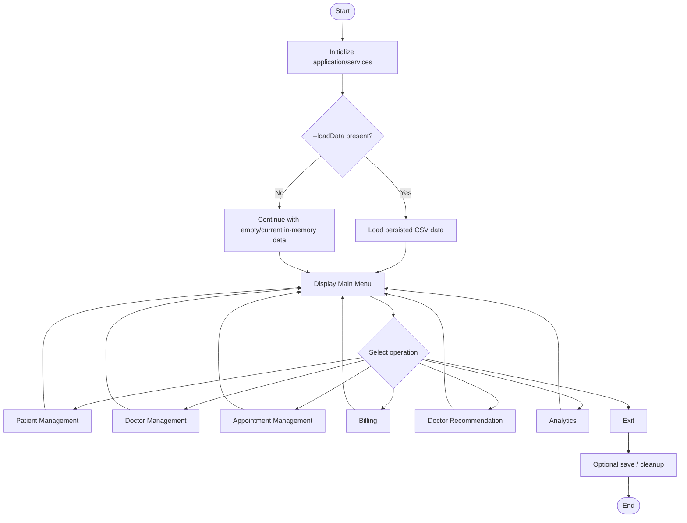

# Application Flow

```mermaid
flowchart TD
 A([Start]) --> B[Initialize application/services]
 B --> C{--loadData present?}
 C -- Yes --> D[Load persisted CSV data]
 C -- No --> E[Continue with empty/current in-memory data]
 D --> F[Display Main Menu]
 E --> F
 F --> G{Select operation}
 G --> H[Patient Management]
 G --> I[Doctor Management]
 G --> J[Appointment Management]
 G --> K[Billing]
 G --> L[Doctor Recommendation]
 G --> M[Analytics]
 G --> N[Exit]
 H --> F
 I --> F
 J --> F
 K --> F
 L --> F
 M --> F
 N --> O[Optional save / cleanup]
 O --> P([End])
```
