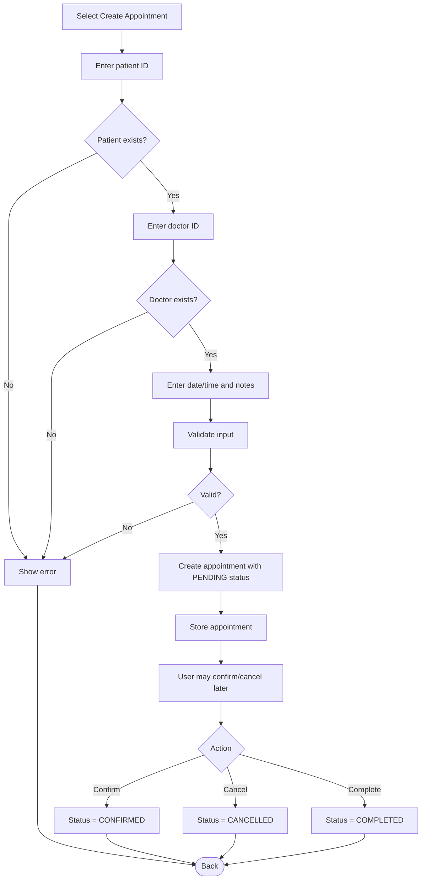

# Appointment Flow

```mermaid
flowchart TD
 A[Select Create Appointment] --> B[Enter patient ID]
 B --> C{Patient exists?}
 C -- No --> X[Show error] --> Z([Back])
 C -- Yes --> D[Enter doctor ID]
 D --> E{Doctor exists?}
 E -- No --> X
 E -- Yes --> F[Enter date/time and notes]
 F --> G[Validate input]
 G --> H{Valid?}
 H -- No --> X
 H -- Yes --> I[Create appointment with PENDING status]
 I --> J[Store appointment]
 J --> K[User may confirm/cancel later]
 K --> L{Action}
 L -- Confirm --> M[Status = CONFIRMED]
 L -- Cancel --> N[Status = CANCELLED]
 L -- Complete --> O[Status = COMPLETED]
 M --> Z
 N --> Z
 O --> Z
```
