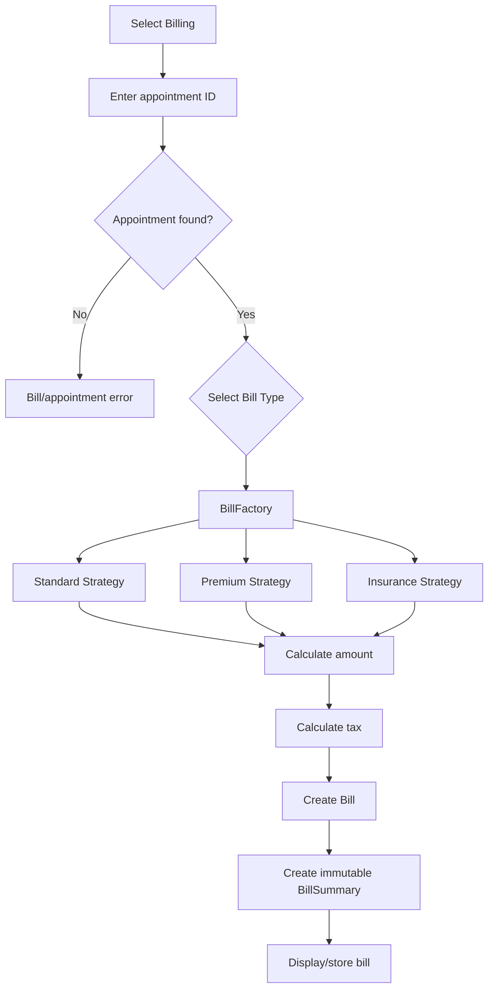

# Billing Flow

```mermaid
flowchart TD
 A[Select Billing] --> B[Enter appointment ID]
 B --> C{Appointment found?}
 C -- No --> X[Bill/appointment error]
 C -- Yes --> D{Select Bill Type}
 D --> E[BillFactory]
 E --> F[Standard Strategy]
 E --> G[Premium Strategy]
 E --> H[Insurance Strategy]
 F --> I[Calculate amount]
 G --> I
 H --> I
 I --> J[Calculate tax]
 J --> K[Create Bill]
 K --> L[Create immutable BillSummary]
 L --> M[Display/store bill]
```
