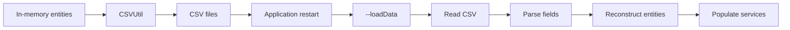

# Persistence Flow

```mermaid
flowchart LR
 A[In-memory entities] --> B[CSVUtil]
 B --> C[CSV files]
 C --> D[Application restart]
 D --> E[--loadData]
 E --> F[Read CSV]
 F --> G[Parse fields]
 G --> H[Reconstruct entities]
 H --> I[Populate services]
```
