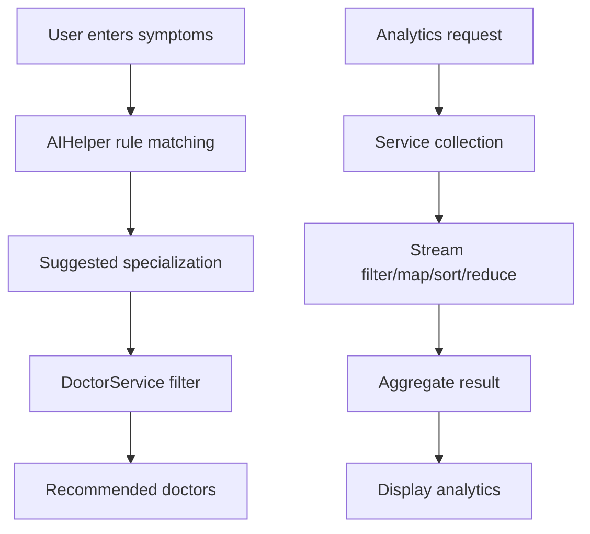

# Recommendation and Analytics Flow

```mermaid
flowchart TD
 A[User enters symptoms] --> B[AIHelper rule matching]
 B --> C[Suggested specialization]
 C --> D[DoctorService filter]
 D --> E[Recommended doctors]
 F[Analytics request] --> G[Service collection]
 G --> H[Stream filter/map/sort/reduce]
 H --> I[Aggregate result]
 I --> J[Display analytics]
```
