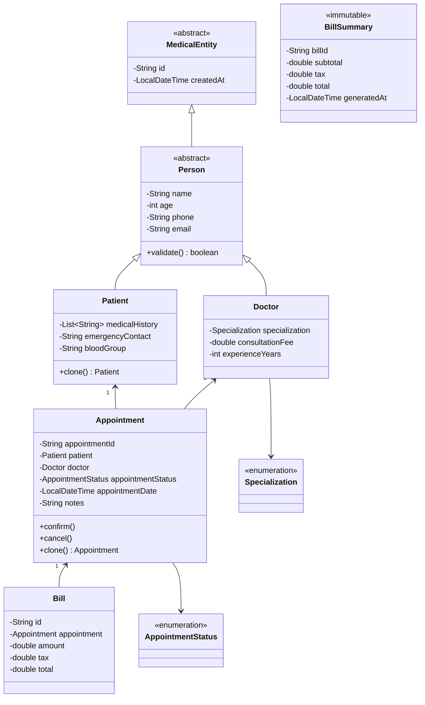

# Entity Layer UML

```mermaid
classDiagram
    class MedicalEntity {
      <<abstract>>
      -String id
      -LocalDateTime createdAt
    }
    class Person {
      <<abstract>>
      -String name
      -int age
      -String phone
      -String email
      +validate() boolean
    }
    class Doctor {
      -Specialization specialization
      -double consultationFee
      -int experienceYears
    }
    class Patient {
      -List~String~ medicalHistory
      -String emergencyContact
      -String bloodGroup
      +clone() Patient
    }
    class Appointment {
      -String appointmentId
      -Patient patient
      -Doctor doctor
      -AppointmentStatus appointmentStatus
      -LocalDateTime appointmentDate
      -String notes
      +confirm()
      +cancel()
      +clone() Appointment
    }
    class Bill {
      -String id
      -Appointment appointment
      -double amount
      -double tax
      -double total
    }
    class BillSummary {
      <<immutable>>
      -String billId
      -double subtotal
      -double tax
      -double total
      -LocalDateTime generatedAt
    }
    class Specialization { <<enumeration>> }
    class AppointmentStatus { <<enumeration>> }
    MedicalEntity <|-- Person
    Person <|-- Doctor
    Person <|-- Patient
    Patient "1" <-- Appointment
    Doctor "1" <-- Appointment
    Appointment "1" <-- Bill
    Doctor --> Specialization
    Appointment --> AppointmentStatus
```
