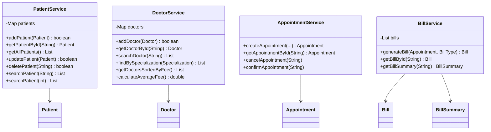

# Service Layer UML

```mermaid
classDiagram
    class PatientService {
      -Map patients
      +addPatient(Patient) boolean
      +getPatientById(String) Patient
      +getAllPatients() List
      +updatePatient(Patient) boolean
      +deletePatient(String) boolean
      +searchPatient(String) List
      +searchPatient(int) List
    }
    class DoctorService {
      -Map doctors
      +addDoctor(Doctor) boolean
      +getDoctorById(String) Doctor
      +searchDoctor(String) List
      +findBySpecialization(Specialization) List
      +getDoctorsSortedByFee() List
      +calculateAverageFee() double
    }
    class AppointmentService {
      +createAppointment(...) Appointment
      +getAppointmentById(String) Appointment
      +cancelAppointment(String)
      +confirmAppointment(String)
    }
    class BillService {
      -List bills
      +generateBill(Appointment, BillType) Bill
      +getBillById(String) Bill
      +getBillSummary(String) BillSummary
    }
    PatientService --> Patient
    DoctorService --> Doctor
    AppointmentService --> Appointment
    BillService --> Bill
    BillService --> BillSummary
```
