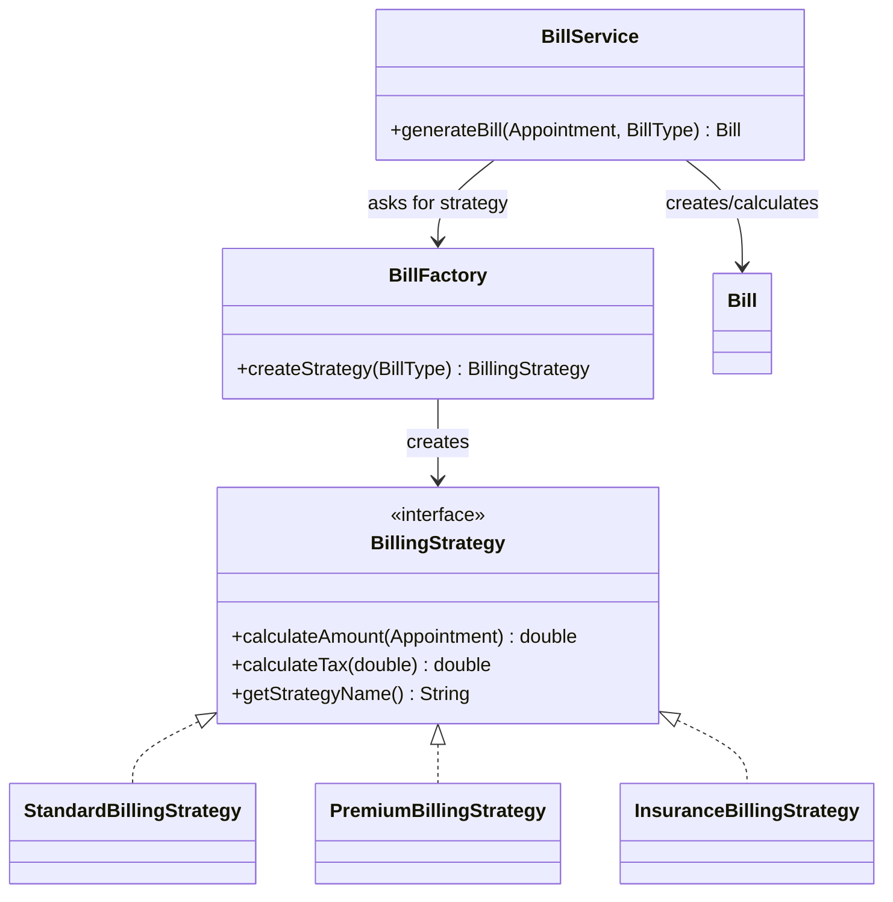

# Billing – Strategy + Factory UML

```mermaid
classDiagram
    class BillService {
      +generateBill(Appointment, BillType) Bill
    }
    class BillFactory {
      +createStrategy(BillType) BillingStrategy
    }
    class BillingStrategy {
      <<interface>>
      +calculateAmount(Appointment) double
      +calculateTax(double) double
      +getStrategyName() String
    }
    class StandardBillingStrategy
    class PremiumBillingStrategy
    class InsuranceBillingStrategy
    class Bill
    BillService --> BillFactory : asks for strategy
    BillFactory --> BillingStrategy : creates
    BillingStrategy <|.. StandardBillingStrategy
    BillingStrategy <|.. PremiumBillingStrategy
    BillingStrategy <|.. InsuranceBillingStrategy
    BillService --> Bill : creates/calculates
```
