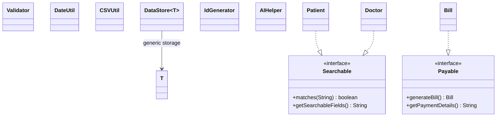

# Utilities and Interfaces UML

```mermaid
classDiagram
    class Searchable {
      <<interface>>
      +matches(String) boolean
      +getSearchableFields() String
    }
    class Payable {
      <<interface>>
      +generateBill() Bill
      +getPaymentDetails() String
    }
    class Validator
    class DateUtil
    class CSVUtil
    class DataStore~T~
    class IdGenerator
    class AIHelper
    Patient ..|> Searchable
    Doctor ..|> Searchable
    Bill ..|> Payable
    DataStore~T~ --> T : generic storage
```
