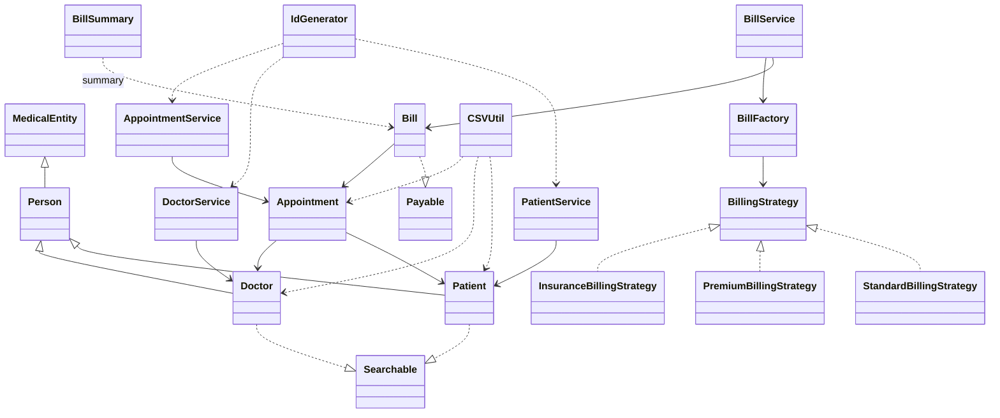

# Overall UML

```mermaid
classDiagram
    MedicalEntity <|-- Person
    Person <|-- Patient
    Person <|-- Doctor
    Patient ..|> Searchable
    Doctor ..|> Searchable
    Bill ..|> Payable
    Appointment --> Patient
    Appointment --> Doctor
    Bill --> Appointment
    PatientService --> Patient
    DoctorService --> Doctor
    AppointmentService --> Appointment
    BillService --> Bill
    BillService --> BillFactory
    BillFactory --> BillingStrategy
    BillingStrategy <|.. StandardBillingStrategy
    BillingStrategy <|.. PremiumBillingStrategy
    BillingStrategy <|.. InsuranceBillingStrategy
    BillSummary ..> Bill : summary
    CSVUtil ..> Patient
    CSVUtil ..> Doctor
    CSVUtil ..> Appointment
    IdGenerator ..> PatientService
    IdGenerator ..> DoctorService
    IdGenerator ..> AppointmentService
```
